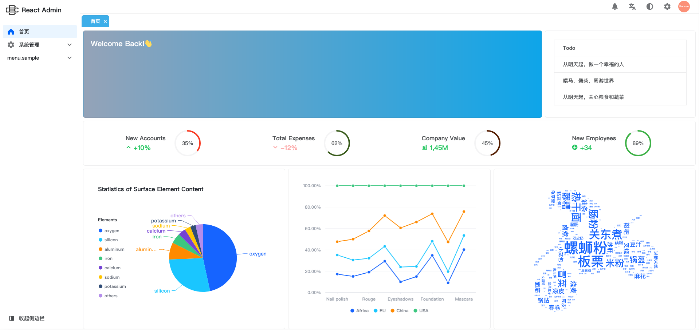

# React Admin

## Setup

Install the dependencies:

```bash
pnpm install
```

## Get Started

Start the json-server:

```bash
pnpm serve
```

> Edit the mock data in `mockdata/db.json`

Start the dev server:

```bash
pnpm dev
```

Build the app for production:

```bash
pnpm build
```

Preview the production build locally:

```bash
pnpm preview
```

